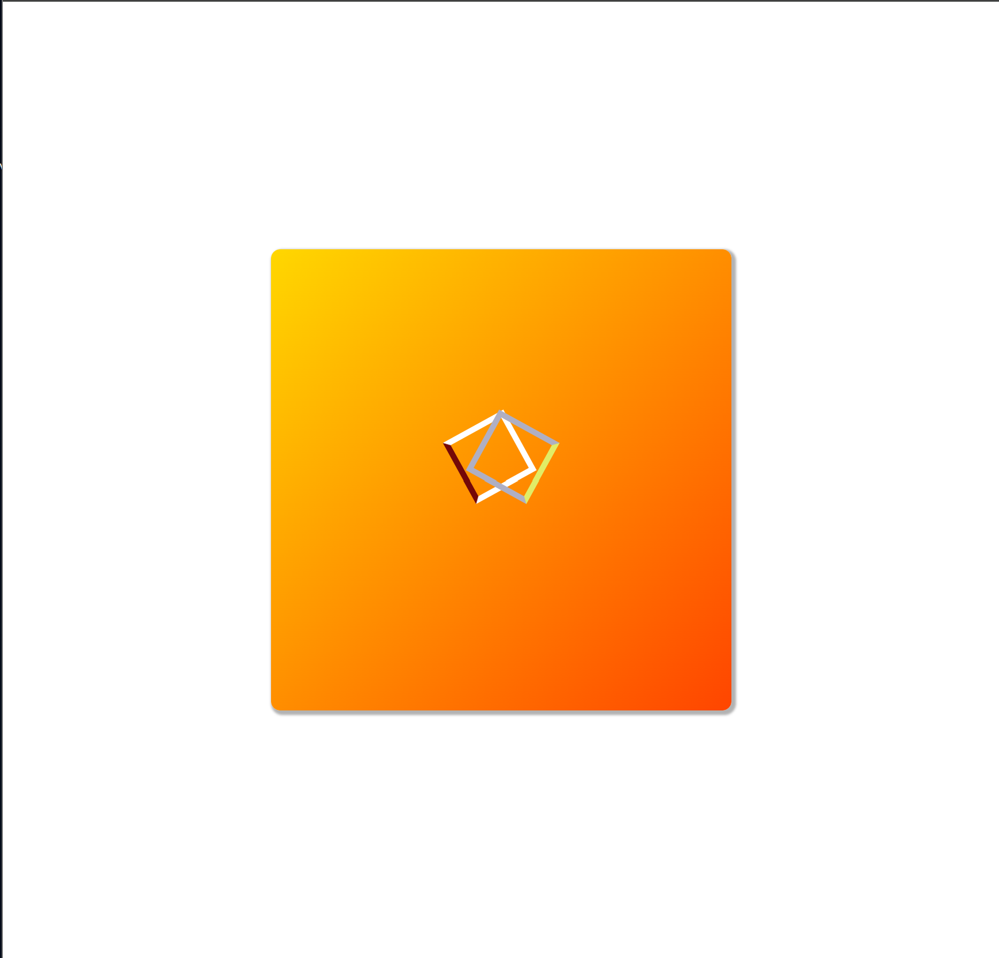

<h1>Circular Progress Indicator Challenge - README</h1>

<h2>Table of Contents</h2>
<ul>
  <li><a href="#introduction">Introduction</a></li>
  <li><a href="#objective">Objective</a></li>
  <li><a href="#requirements">Requirements</a></li>
  <li><a href="#project-structure">Project Structure</a></li>
  <li><a href="#installation-and-setup">Installation and Setup</a></li>
  <li><a href="#usage">Usage</a></li>
  <li><a href="#preview">Preview</a></li>
  <li><a href="#contributing">Contributing</a></li>
  <li><a href="#contact">Contact</a></li>
</ul>

<h2 id="introduction">Introduction</h2>

Welcome to the Circular Progress Indicator Challenge! This project involves creating a visually appealing circular progress indicator using only HTML and CSS. This README provides a detailed guide on setting up, customizing, and using the circular progress indicator in your projects.

<h2 id="objective">Objective</h2>

The main goal of this challenge is to develop a circular progress indicator that:

<ul>
  <li>Clearly represents progress through a circular graphical display.</li>
  <li>Allows for easy customization of size, color, and progress percentage.</li>
  <li>Does not require any JavaScript, relying solely on HTML and CSS.</li>
</ul>

<h2 id="requirements">Requirements</h2>

To complete this challenge, you will need:

<ul>
  <li>Basic knowledge of HTML and CSS.</li>
  <li>A modern web browser (e.g., Google Chrome, Mozilla Firefox).</li>
  <li>A code editor (e.g., VS Code, Sublime Text).</li>
</ul>

<h2 id="project-structure">Project Structure</h2>

The project directory includes the following files and folders:

<pre>
circular-progress-indicator/
│
├── index.html
├── styles.css
└── README.md
</pre>
<ul>
  <li><code>index.html</code>: HTML structure for the circular progress indicator.</li>
  <li><code>styles.css</code>: CSS styles for the circular progress indicator.</li>
  <li><code>README.md</code>: This README file.</li>
</ul>

<h2 id="installation-and-setup">Installation and Setup</h2>

Follow these steps to set up the project:

<ol>
  <li><strong>Clone the Repository</strong>:
    <pre><code>git clone https://github.com/Yashi-Singh-1/Circular-Progress-Indicator.git</code></pre>
  </li>
  <li><strong>Navigate to the Project Directory</strong>:
    <pre><code>cd circular-progress-indicator</code></pre>
  </li>
  <li><strong>Open <code>index.html</code> in Your Browser</strong>: You can open the file directly in your browser or use a local server to serve the files.</li>
</ol>

<h2 id="usage">Usage</h2>

To use the circular progress indicator, follow these steps:

<h3>HTML Structure</h3>

In your HTML file, include the necessary structure within the <code>&lt;body&gt;</code> tag to create the circular progress indicator.

<h3>CSS Styles</h3>

Link the CSS file in the <code>&lt;head&gt;</code> section of your HTML to apply the styles for the circular progress indicator.

<h2 id="preview">Preview</h2>

Here is a preview of how the circular progress indicator looks and functions:

 <!-- Replace with an actual screenshot -->

This visual representation showcases a fully functional and customizable circular progress indicator, ready to be integrated into any web project.

<h2 id="contributing">Contributing</h2>

Contributions are welcome! To contribute:

<ol>
  <li>Fork the repository.</li>
  <li>Create a new branch (<code>git checkout -b feature-branch</code>).</li>
  <li>Make your changes and commit them (<code>git commit -m 'Add some feature'</code>).</li>
  <li>Push to the branch (<code>git push origin feature-branch</code>).</li>
  <li>Create a new Pull Request.</li>
</ol>

<h2 id="contact">Contact</h2>

For more information or any inquiries, feel free to contact me:

<ul>
  <li><strong>GitHub Profile</strong>: <a href="https://github.com/Yashi-Singh-1" target="_blank">github.com/Yashi-Singh-1</a></li>
  <li><strong>LinkedIn Profile</strong>: <a href="https://www.linkedin.com/in/yashi-singh-b4143a246" target="_blank">www.linkedin.com/in/yashi-singh-b4143a246</a></li>
</ul>

Thank you for checking out this challenge. Happy coding!

